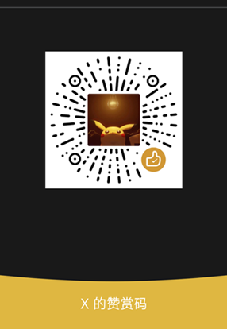

Guides lead a user through a specific task they want to accomplish, often with a sequence of steps.
Writing a good guide requires thinking about what your users are trying to do.

## Further reading

